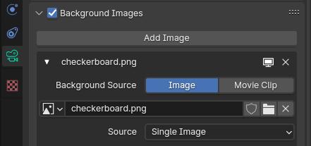
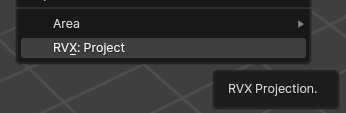
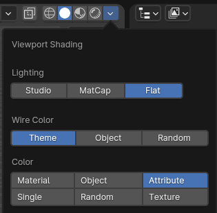
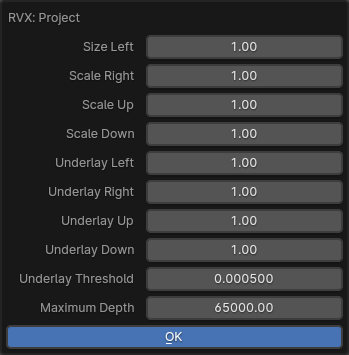

# RVX Projector

Add-on for Blender for projection-mapping 2D art retaining pixel-art look.

## Examples

The technique behind RVX Projector has been used to make Scumm Bar 3D demos, which recreate a scene from The Secret of Monkey Island in a 3D engine.

## Usage

RVX Projector will project camera's Background Image onto the scene creating a new object consisting of a cloud of quads, one per pixel from the source image. The quads will be colored using vertex attributes.

* Download and unzip the add-on. Install it via Blender's Edit -> Preferences -> Add-ons -> Install function. Once installed, make sure to enable (tick) the add-on.

* Add a Background Image to the Camera. Ensure the image and model in Camera Perspective view match up perfectly.

    

* To exclude some objects or collections from the projection, exclude them from rendering (camera icon in the Outliner).

* Select __RVX: Project__ from the __View__ menu

    

* Click __OK__ to accept projection parameters.

* Projected mesh will be created on top of the original model, so it's best to hide the model temporarily (eye icon in Outliner)

* To see vertex colors in the viewport, switch to Viewport Shading and use Attribute for Color.

    

* Once you're happy with the results, you can export the projected mesh for use in any 3D game engine.

## Parameters

The biggest challenge with this technique are gaps between quads when camera moves away from its original projection location. To counter this you can:
* adjust the size of each quad, in each direction
* adjust the size of the underlay (extension of quads behind other quads), in each direction, and the minimum depth difference for underlay to be created

You may need to set the parameters differently for different parts of the scene to get the best results.

## License

Licensed under GNU General Public License v3.0
